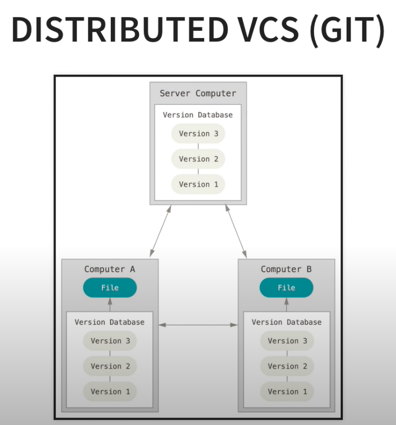
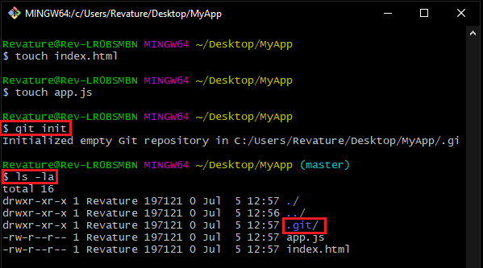
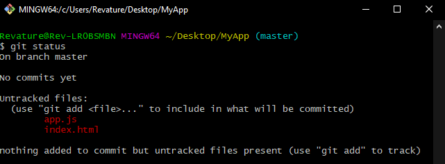
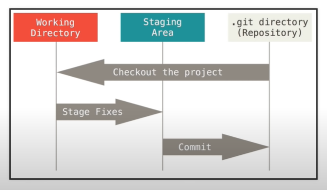
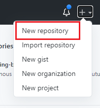
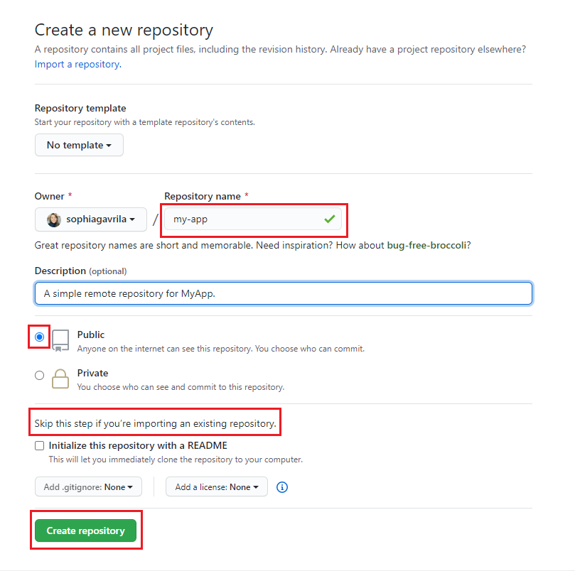
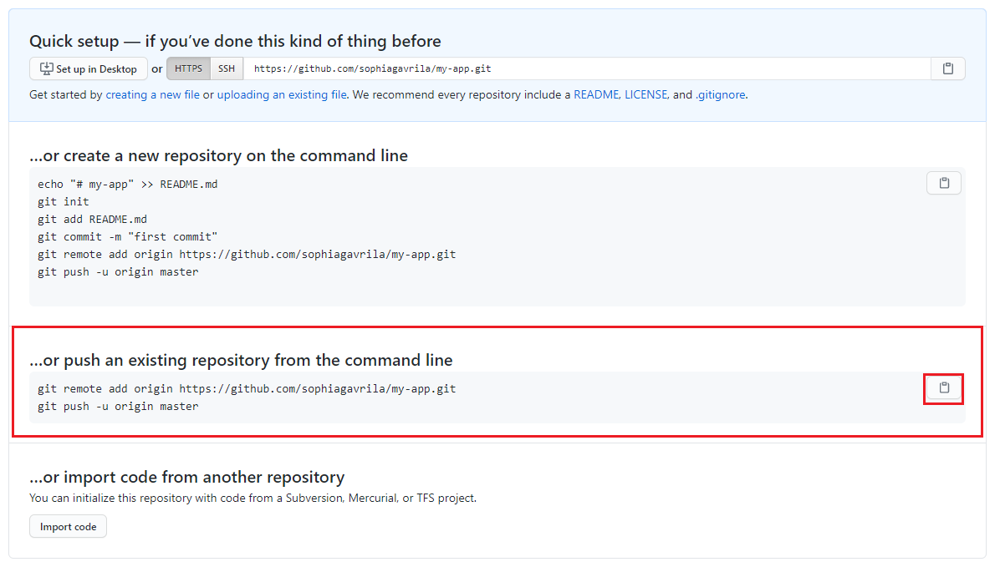

## What is Git?

> If reading really isn't your thing, here is a [very helpful and *very* corny video](https://app.pluralsight.com/course-player?clipId=8dc1a5de-01c5-452e-a45f-d2f77a980e1c) about Git.

We will start by learning the Git Command-line tools.

Git is a **distributed version control system**. This means that the entire codebase and history of a project is available on every developer’s computer as a **local repository** , which allows for easy branching and merging. This local repository contains all of the information that the **remote repository** has, based on the last time that you synced those two together.

Even if you don't have access to the **remote repository**, you can still view all of the changes that have been made, and contributers can maintain a copy of this record on their own machines.



## What is GitHub?

Before we get started with installing and configuring Git, you must first create a profile on [GitHub](https://github.com/).

GitHub is a website and cloud-based service that helps developers store and manage their code, as well as track and control changes to their code.

GitHub is a **Git repository hosting service**, but it adds many of its own features. While Git is a *command line tool*, GitHub provides a Web-based graphical interface. It also provides access control and several collaboration features, such as a wikis and basic task management tools for every project.

## Installing and Configuring Git

Navigate to to this file for instructions on [installing Git (for Windows)](https://github.com/sophiagavrila/welcome-to-git/blob/main/installation/git-windows-install.md) and [here for Mac](https://github.com/sophiagavrila/welcome-to-git/blob/main/installation/git-mac-install.md).

Once you have successfully installed Git, you will need to configure it. The configuration values help us keep track of who is making what change within a project. 

1. Right click on your desktop and click `Git Bash Here`.  Alternatively, open your terminal and run `git`.
2. Run the following commands in your terminal.  Substitute `"John Doe"` with your GitHub username, and `"johndoe@example.com"` with whatever email address you used to create your GitHub account.

```code
git config --global user.name "John Doe"
git config --global user.email johndoe@example.com
```

## Initialize a Repository From Existing Code
Let's imagine that you've begun developing a simple web application called `MyApp` on your local machine and you want to integrate it into GitHub.

1. Navigate to where the project folder `MyApp` is saved on your computer.  In this example, the folder exists on the desktop.
2. Right click on the dekstop and select `Git Bash Here`.  A terminal will appear in which you can run **Linux commands**.
3. You can return the current path of the directory you're in by running `pwd`. 
4. Use the command `ls` to list all of the directories & files present within this location.  You should see `MyApp` listed.
5. To change the directory, use the command `cd` to change the directory you're operating in to that of `MyApp`.

```
$ cd MyApp
```

6. Once inside `MyApp`, run the following commands to create an `index.html` file and an `app.js`.

```
$ touch index.html
$ touch app.js
```

7. To begin tracking this code with Git, we initialize a local repository by running the command `git init`.
8. If you run the `ls-la` command again, you'll notice that a `.git` directory has been added to our project. 



The `.git` folder contains all the information that is necessary for your project in version control and all the information about commits, remote repository address, etc.

If we wanted to, we could remove this `.git` file with the command `rm -rf .git`, but we want to retain it so that we can track any changes made to our project.

## Committing to a Local Repository
We are now using git to track any files created in this directory, but we haven't commit anything yet.

1. Open `MyApp` in VSCode.
2. Add the following to the `index.html` file.

```html
<!DOCTYPE html>
<html>
  <head>
    <meta charset="utf-8">
    <title>A Simple HTML Page</title>
  </head>

  <body>
    <h1>Hello, world!</h1>
  </body>
</html>
```

3. Add the following to the `app.js` file.

```javascript
console.log('Hello!')
```

### Tracking Files with `git status`
If we Git Bash within our `MyApp` directory once more and run the command `git status`, we can see that we have several untracked files which will be listed in <span style="color: red;">red</span>. 



### Working Directory, Staging Area, Repository



* Untracked and modified files will exisit within the **Working Directory**. The files in the **Working Directory** are listed when we run `git status`.

* The **Staging Area** is where we organize what we want to be commited to our repository.  The **Staging Area** allows us to pick and choose which files we want to commit and when.  Commits should be details regarding what changes were made in individual files.

1. To add files to the **Staging Area** run the commmand `git add <file-name>`. To add all of the changes we've just made, run the following command.

```
$ git add .
```

When you run `git status` again, you should see the recently staged files in green.

2. To **commit** these changes run:
```
$ git commit -m "initial commit"
```

## Committing to a Remote Repository
So far we have initialized a local repository to track changes made to our source code.  In order to connect this to a remote repository on GitHub, do the following.

1. Navigate to [GitHub.com](https://github.com/). Make sure you're logged in as the same user that you configured in GitBash on your computer.

2. In the top right hand corner, under the `+` button, click `New Repository`.



3. Title your repository.  Do not initialize it with a README. Click `Create repository`.



4. Since we will be pushing the existing local repository from the command line using the `git remote add origin` command, click the clipboard icon next to the third option, as highlighted below.



5. Git Bash within your `MyApp` folder and paste the copied commands:

```
$ git remote add origin https://github.com/sophiagavrila/my-app.git
$ git push -u origin master
```

6. Now when you navigate to your remote repository on GitHub.com you will see that any changes you make will be reflected online.

#### Remember the steps you will take whenever commiting changes:
```
$ git add .
$ git commit -m "a message about changes"
$ git pull
$ git push
```

The `git pull` command is used to fetch and download content from a remote repository and immediately update the local repository to match that content, **before** you push your changes.

### References

* [Git Cheat Sheet](https://github.github.com/training-kit/downloads/github-git-cheat-sheet.pdf)
* [Git Pro eBook](https://git-scm.com/book/en/v2)
