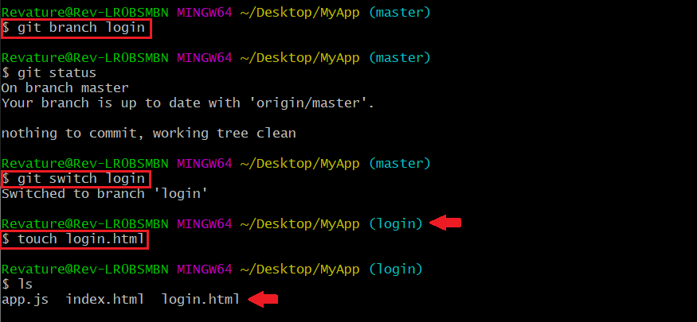

## Git Branching
Branching is a feature available in most modern version control systems.  Instead of copying files from directory to directory, Git stores a **branch** as a reference to commit.  The branch itself represents the `HEAD` of a series of commits.

The default branch name in Git is `master`, which commonly represents the official, working version of your project.  As you start making commits, the master branch points to the last commit you made.  Everytime you commit, the master branch pointer moves forward automatically. Think of a branch as a timeline of versions of a project as it progresses.

Branching is a strategy that allows developers to take a snapshot of the master branch and test a new feature without corrupting the project in production. If the tests are successful, that feature can be **merged** back to the master branch and pushed to production.


### Create a login branch
Imagine that you want to create a login functionality feature on your `MyApp` project.

1. To create a new branch called `login`, within your `MyApp` directory run: 
```
$ git branch login
```
2. To `checkout` to the newly created branch, run:
```
$ git checkout login
```
Now you will be able to create and edit files that will only exist on this branch until you merge it with `master`.

**A note on `git checkout` vs. `git switch`:** Please keep in mind that both `checkout` and `switch` will change branches to the branch you specify following the command. There are some limitations to each command which you can explore in further detail [here](https://www.atlassian.com/git/tutorials/using-branches/git-checkout).

3. Create an `html` document called login.html by running `touch login.html` within the `login` branch.



4. Fill out your `login.html` page with a simple template such as the following:

```html
<html>
    <head>
        <title>My App</title>
    </head>
    <body>
        This is my App!
        Login
    </body>
</html>
```

5. Save your file and add the changes to staging within the `login` branch with `git add .`.  Then commit with `git commit -m "add login form"`.

6. Now return to your master branch with `git checkout master`.

7. To integrate the files that you created and populated in the login branch, run the following commands to merge the `login` branch, add the files, commit changes, then push to the remote repository.

```
$ git merge login -m "merge login form"
$ git add .
$ git commit -m "add login form"
$ git pull
$ git push
```

### References
* [Git Branching](https://git-scm.com/book/en/v2/Git-Branching-Branches-in-a-Nutshell)